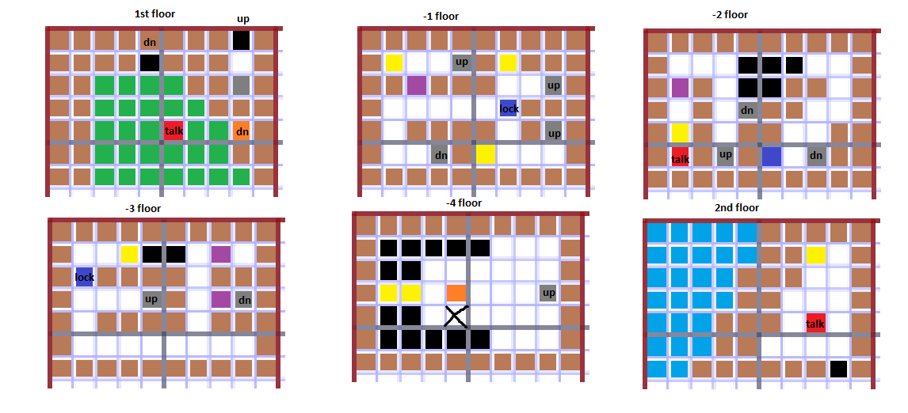
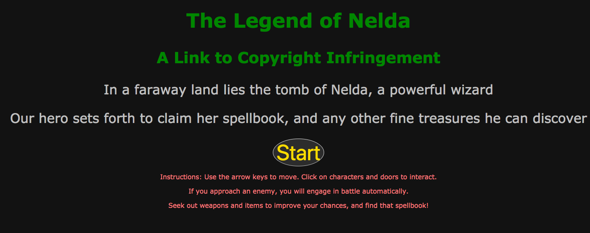
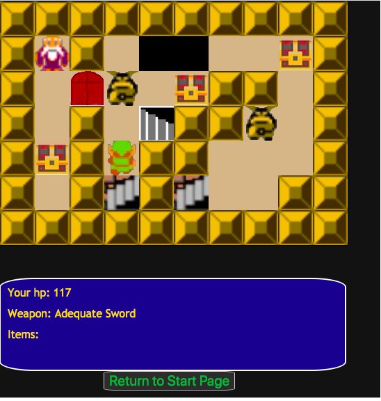

# Project0

For this project, I have endeavored to create a short adventure game reminiscent of NES classic The Legend of Zelda.  The game uses 12 HTML pages, a CSS file, 8 Javascript files as well as JQuery, and 22 sprites.  Due to the use of local storage, the player can move between levels while maintaining the game state.

## MVP:

In this game, the player takes control of a character bent on plundering the tomb of Nelda, a long-dead sorceress, searching for her spellbook.  The player will navigate through 6 levels of pre-rendered maps, finding items, engaging with enemies, and meeting NPCs.  When battling enemies, damage is randomized, although the player can find superior weapons, as well as items that will improve the odds.  

## Game whiteboard:

## Game images:

## User stories:

I. The game opens with a title screen.  When the player presses the start button, the game begins and they are placed on the first map. There are no enemies on the first map. There is one NPC.  This NPC has randomized dialogue and can provide a special item.  Lastly, when certain conditions are met, this NPC provides the means for completing the game.  

II. When the player reaches a designated spot, they will move into the second map, which appears on a new page.  The second map has enemies, treasures, and a locked door to interact with.  

III. The third map has another NPC, another locked door, more items, a hidden weapon, and hazards in the form of holes in the floor.

IV. The fourth map has only enemies, treasures, and holes.  

V.  On the fifth map, the player finds Nelda's grave, a variety of treasures, and a boss battle.

VI. If the player survives to the sixth map, they will find the final boss battle and the last and most important treasure.

VII.  There is one secret area and four different possible endings.